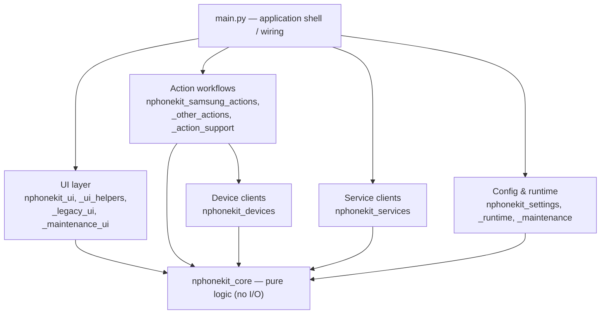

# Architecture

nPhoneKIT started as a single `main.py` and has been refactored into a thin
application shell plus focused, testable modules. This document is a map for
contributors.

## Layers



Dependency direction points **toward `nphonekit_core`**, which is pure and
depends on nothing in the project. `main.py` sits at the top and wires the real
objects together.

## Modules

| Module | Purpose |
| --- | --- |
| `main.py` | Application shell: builds the UI actions, wires modules together, and starts the app. Most functions here are thin wrappers that inject real dependencies into the modules below. |
| `nphonekit_core.py` | **Pure logic, no I/O**: parsing (`parse_model`, `parse_imei`, `parse_adb_devices`, `parse_fastboot_devices`, `parse_devconinfo`), settings merge, and device-safety guards (`select_target_device`, `multi_device_note`, `has_required_group`). The most heavily unit-tested module. |
| `nphonekit_devices.py` | Device command clients: `ADB`, `AT`, `SerialManager`, `FastbootPartitionEraser`, and the Samsung clients (`SamsungRebootClient`, `SamsungDeviceInfoClient`, `SamsungWifiTestClient`, `SamsungBloatwareRemover`, `SamsungDownloadModeClient`, `SamsungModemUnlocker`, `SamsungPreloader`), plus `MtkClientRunner`, `BatteryLevelClient`, and serial-permission helpers. |
| `nphonekit_samsung_actions.py` | Samsung FRP unlock workflows (`SamsungFrpActions`) and the 2022 command set. |
| `nphonekit_other_actions.py` | Non-Samsung actions: MTK client, LG screen unlock, Motorola fastboot FRP, battery helpers, feedback submission. |
| `nphonekit_action_support.py` | Shared helpers for action workflows (unlock-method loading, modem unlock, contribution prompt gating). |
| `nphonekit_services.py` | Network service clients: `FeedbackClient`, `UpdateClient`, `TelemetryClient`, and `public_hardware_uuid`. |
| `nphonekit_ui.py` | PyQt5 components: `MainWindow`, `SettingsDialog`, `Worker`/`WorkerSignals`, `QtDialogHelper`, overlays and tooltips. |
| `nphonekit_ui_helpers.py` | Reusable Qt presentation helpers (input dialog, stylesheet, logo lookup). |
| `nphonekit_legacy_ui.py` | The legacy Tk workflow-confirmation dialog (`stw`), run in a child process. |
| `nphonekit_maintenance.py` | Maintenance/diagnostics: OS info, serial self-fix. |
| `nphonekit_maintenance_ui.py` | Small UI helpers for maintenance/diagnostics flows. |
| `nphonekit_settings.py` | Settings loading and persistence (`SettingsStore`, `DEFAULT_SETTINGS`). |
| `nphonekit_runtime.py` | Runtime bootstrap for the hardware-facing services (so importing `main.py` has no side effects). |
| `deps/mtkclient/` | Vendored [mtkclient](https://github.com/bkerler/mtkclient) (upstream project; not maintained here). |

## Design principles

- **Pure core.** `nphonekit_core` has no I/O or global state, so its logic can be
  unit-tested directly.
- **Dependency injection.** Extracted functions/clients receive their
  dependencies as parameters (e.g. `output=print`, an ADB object, a `post`
  callable). `main.py` injects the real ones; tests inject fakes.
- **Importable entrypoint.** `main.py` performs no hardware/network work at
  import time (see `nphonekit_runtime`), which is what makes
  `tests/test_main_import.py` possible.
- **Device-safety pre-flight guards.** Destructive operations refuse to run
  against an ambiguous target:
  - fastboot erase / `fastboot -w` and ADB debloat require **exactly one** ready
    device (`select_target_device`), targeting it explicitly.
  - serial detection warns when **two or more distinct physical devices** are
    present, grouping a phone's multiple interfaces by USB VID/PID/serial
    (`multi_device_note`).

## Tests & CI

Each module has a matching `tests/test_*.py`. CI (`.github/workflows/ci.yml`)
runs `ruff check .` and `pytest` on Python 3.10 and 3.12. To run locally:

```bash
python3 -m venv .venv && . .venv/bin/activate
pip install -r requirements.txt -r requirements-dev.txt
ruff check .
pytest
```
